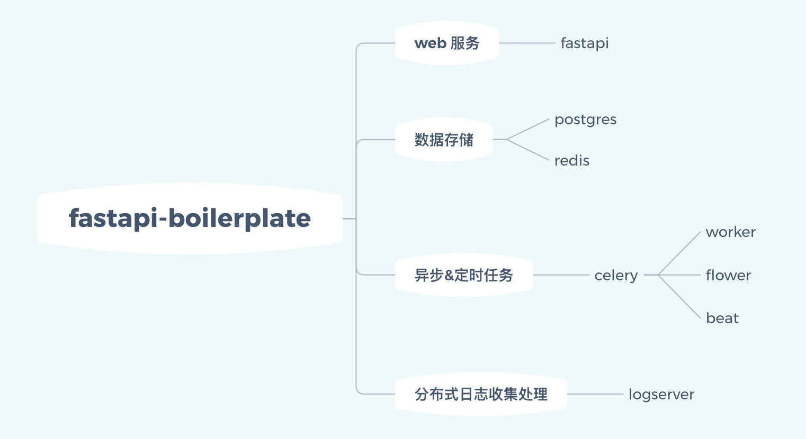

# Fastapi WEB 开发模版

Fastapi 使用了 Python 的异步 IO 特性，可以提升比较多的性能，API 使用起来比较简洁直观，更加符合开发者的习惯。

Fastapi 更多特性参考[文档](https://github.com/tiangolo/fastapi)。

本模版在 Fastapi 的功能基础上集成了更多常用的功能，用户可以根据自己的需求进行删减，删减比增加可能更加容易一些。

# 为什么要开发这个项目

其实这个项目几年前都开放了，但是后来一直没怎么维护，最近整理资料时一并升级了相关的代码，维护这个项目的出发点：

- **不重复走弯路**。自己重新整理的过程中好多依赖和能力都发生了更新，整理还是比较费时的，特别是老旧代码兼容的问题，整理成快速开发的模版，方便下次快速应用，不重复走弯路。
- **让好用的东西更简单的被使用**。自己开发 web 也有很多年了，也见过比较多优秀业务系统，他们承载着高并发和丰富的系统功能，这些能力都与底层的技术结构分不开，新手刚入行的时候，对这些东西的了解是比较少的，要学习的东西很多，所以如果刚开始有一个比较完善的开发模版，有助于能力提升，少走弯路，尽量把精力留给其他需要探索的事情。


# 模版结构

整个模版一共有 4 个功能模块， 7 个组件：



# 特性支持

- **较好的移植性**：使用 Docker/DockerCompose 开发部署。
- **高性能 Python IO**：使用 AsyncIO/Fastapi 开发，开发简单，性能高。
- **分布式 Log 支持**：自定义 TCP Log Server 分布式收集 WEB 日志，提供 JSON 格式，可供分析统计。
- **ORM/plain SQL**：支持使用 ORM 或者直接使用 SQL 也可，其中 ORM 使用 SQL Alchemy，普通的 SQL 使用 aiosql 维护调度。
- **易于开发调试**：提供开发环境调试助手，可以针对各个子模块单独调试，子功能进行调试。
- **API 自动化测试支持**：可以使用 pytest 进行 API 自动测试。

# 性能测试

> 备注：历史数据，未更新

使用 WRK 进行测试，可通过运行 `benchmark.sh` 来测试。


## 测试硬件信息

aliyun ECS 16C 32G 2.4G with 8 process.

## 不使用数据库参与压测

测试使用 4 线程 300 并发进行测试，测试 echo 模式：
```shell
./wrk -t 4 -c 400 -d10s http://127.0.0.1:8000/api/v1/user/greeting
Running 10s test @ http://127.0.0.1:8000/api/v1/user/greeting
  4 threads and 400 connections
  Thread Stats   Avg      Stdev     Max   +/- Stdev
    Latency    33.45ms   77.33ms   1.01s    96.80%
    Req/Sec     5.35k     2.66k   12.48k    66.75%
  212805 requests in 10.05s, 43.43MB read
  Socket errors: connect 0, read 2078, write 0, timeout 0
Requests/sec:  21179.64
Transfer/sec:      4.32MB
```

## Postgres 参与测试

测试使用 4 线程 300 并发进行测试，测试时 postgres 参与读取：

```shell
./wrk -t 4 -c 300 -d10s http://127.0.0.1:8000/api/v1/user/list
Running 10s test @ http://127.0.0.1:8000/api/v1/user/list
  4 threads and 300 connections
  Thread Stats   Avg      Stdev     Max   +/- Stdev
    Latency    66.94ms   49.40ms 604.50ms   73.71%
    Req/Sec     1.22k   252.57     1.87k    64.75%
  48659 requests in 10.10s, 11.09MB read
Requests/sec:   4819.52
Transfer/sec:      1.10MB
```
## Redis 参与测试

测试使用 4 线程 300 并发进行测试，测试时 redis 参与读取：
```shell
./wrk -t 4 -c 400 -d10s http://127.0.0.1:8000/api/v1/user/counter
Running 10s test @ http://127.0.0.1:8000/api/v1/user/counter
  4 threads and 400 connections
  Thread Stats   Avg      Stdev     Max   +/- Stdev
    Latency    58.08ms  140.53ms   1.05s    94.98%
    Req/Sec     4.04k     1.95k    8.53k    66.00%
  160779 requests in 10.04s, 31.89MB read
  Socket errors: connect 0, read 1820, write 0, timeout 0
Requests/sec:  16012.11
Transfer/sec:      3.18MB
```


# 运行

## 环境变量配置

系统运行之前，需要配置一下环境变量，环境变量存储在 `.env/.production` 文件夹中，环境变量中尽量不要添加注释，否则无法解析。

```shell
cp .sample.fastapi .env/.production/.fastapi
cp .sample.postgres .env/.production/.postgres
```

拷贝进去之后根据自己的需要修改相应的配置，主要需要关注：
- **POSTGRES_DATA_DIR**：用来存储 postgres 文件，防止数据库内容丢失，不要存储在 docker 容器中。
- **LOG_BASE_PATH**：fastapi web access 日志存储目录，会自动备份删除日志，方便后续日志分析和查询。
- **CELERY_BEAT_DBFILE_DIR**：celery 定时任务运行记录，存储定时任务的运行情况。

配置完成，请检查环境变量是否配置符合预期，检查办法：
```shell
# 测试不同的变量获取是否符合预期
eval $(cat .envs/.production/.fastapi .envs/.production/.postgres) echo "${POSTGERS_PORT}"
```
其余变量根据自己的情况配置，非必要配置。

## 环境准备

如果使用 docker-machine 测试开发项目时，则可以直接运行即可，跳过此节。如果是在 linux 环境中开发测试，需要处理好文件权限的问题，目前 celery / fastapi 日志均需要使用系统文件夹存储，所以需要给文件夹添加权限。

目前项目使用的用户组和用户信息：
- UID:1000
- GID:1000

在运行之前，需要针对宿主文件夹：
- CELERY_BEAT_DBFILE_DIR
- LOG_BASE_PATH
进行授权，授权方法为：
```shell
chown -R 1000:1000 your_CELERY_BEAT_DBFILE_DIR
chmod g+s your_CELERY_BEAT_DBFILE_DIR
chown -R 1000:1000 your_LOG_BASE_PATH
chmod g+s your_LOG_BASE_PATH
```


## 测试运行

使用了 `make` 简化管理，也可以自己使用 docker-compose 命令，但是使用单独的命令时，环境变量需要做适当的调整，不允许在环境变量配置文件中使用系统环境变量。

``` shell
# build docker image
make build

# start all application
make up

# stop all application
make down
```

>*注意*：默认的 compose 配置中每个应用仅有单独的一个实例，未配置多实例部署，生产环境中，建议配合 docker swarm/ replica 实现多机器多实例部署。

# 扩展

后续在单独的使用文档中说明。

# 联系方式

本项目不接受指导或者文档以外的支持，如有定制需求，咨询 smileboywtu@gmail.com